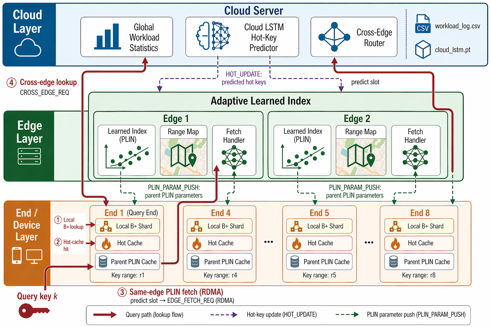

# PLIN Cloud-Edge-Device Learned Index

This repository implements a Cloud-Edge-Device learned-index runtime built around PLIN. The system combines regional learned indexes, local B+ tree shards, hot-key caching, LSTM-based hot-key prediction, and an optional RDMA transport for the End-to-Edge query path.



<details>
<summary><strong>Read this README in Chinese</strong></summary>

# PLIN 云边端学习索引系统

本仓库实现了一个基于 PLIN 的云边端学习索引运行时系统。系统结合了边缘侧区域学习索引、端侧本地 B+ 树分片、热点缓存、基于 LSTM 的热点预测，以及可选的 End-to-Edge RDMA 传输路径。


## 项目概览

系统由三类运行时进程组成：

| 层级 | 可执行文件 | 职责 |
|---|---|---|
| Cloud | `cloud_server` | 维护全局访问流视角，加载 Cloud LSTM，生成热点 key 更新，并路由跨 Edge 查询。 |
| Edge | `edge_server` | 管理一组 End 的 key range，构建区域 PLIN，向 End 推送学习索引参数，处理同 Edge 查询，并转发 Cloud 控制消息。 |
| End | `end_node` | 持有本地 B+ 树分片、热点缓存和父 Edge 的 PLIN 参数副本，执行查询并输出阶段统计。 |

当前默认拓扑为 1 个 Cloud、2 个 Edge、10 个 End。拓扑定义在 `src/common/topology.yaml`，可以通过配置文件调整各节点的地址、端口、从属关系和 key range。

## 查询流程

End 对每个查询 key 执行四阶段查找：

1. **本地 B+ 树**：如果 key 属于当前 End 的本地 range，直接查询本地 shard。
2. **热点缓存**：如果本地未命中，查询 End 侧 libcuckoo 热点缓存。
3. **同 Edge PLIN**：如果目标 End 属于同一个 Edge，End 使用父 Edge 下发的 PLIN 参数预测逻辑叶子。启用 RDMA 时，End 优先使用 RDMA READ 读取 Edge 暴露的稳定快照；不可用或未命中时，回退到 `EDGE_FETCH_REQ`。
4. **跨 Edge 路由**：如果目标 End 属于另一个 Edge，请求按 End → Edge → Cloud → Target Edge 的路径路由。

查询阶段统计由 `end_node` 输出，benchmark 脚本会聚合为 CSV 和 Markdown 报告。

## 当前架构

```text
                      +----------------------+
                      | Cloud                |
                      | cloud_server         |
                      | - workload view      |
                      | - Cloud LSTM         |
                      | - HOT_UPDATE         |
                      | - cross-Edge routing |
                      +----------+-----------+
                                 |
                 Edge control TCP|
                                 |
             +-------------------+-------------------+
             |                                       |
    +--------+---------+                    +--------+---------+
    | Edge 1           |                    | Edge 2           |
    | edge_server      |                    | edge_server      |
    | regional PLIN    |                    | regional PLIN    |
    | RDMA/TCP endpoint|                    | RDMA/TCP endpoint|
    +---+---+---+---+--+                    +---+---+---+---+--+
        |   |   |   |                           |   |   |   |
      End1 ... End5                           End6 ... End10
```

End-to-Edge traffic can use TCP, RDMA, or auto mode. Edge-to-Cloud traffic remains TCP.

## 传输模式

| 模式 | 说明 |
|---|---|
| `tcp` | 使用长度前缀 TCP frame。该模式不需要 RDMA 硬件。 |
| `rdma` | 使用 RDMA CM/libibverbs 建立 End-to-Edge 连接。控制消息走 RDMA SEND/RECV，同 Edge 快路径可使用 RDMA READ。 |
| `auto` | End 先尝试 RDMA，如果不可用则回退到 TCP。该模式适合开发和兼容性测试；正式 RDMA 性能实验建议使用 `rdma`。 |

RDMA 只作用于 End-to-Edge 查询链路。Cloud 控制链路和跨 Edge 路由仍然使用 TCP。

## 代码结构

```text
.
├── src/
│   ├── core/index/        # PLIN core, local model, leaf nodes, B+ tree support
│   ├── common/            # protocol, RPC, transport, RDMA snapshot, topology
│   ├── cloud/             # Cloud runtime and Cloud LSTM runner
│   ├── edge/              # Edge runtime and regional PLIN service
│   ├── end/               # End runtime, hot cache, parent PLIN cache
│   └── tools/workload/    # workload generation tool source
├── hot_lstm/              # LSTM training/export code and model files
├── scripts/               # run, stop, status, benchmark helpers
├── doc/                   # architecture notes and generated figures
├── output/                # runtime logs and benchmark reports
├── third_party/           # TLX and optional libtorch location
├── libcuckoo/             # hot-cache dependency
└── legacy/                # archived prototype code, not part of the active build
```

## 关键组件

### `src/core/index/`

| 文件 | 职责 |
|---|---|
| `plin_index.h` | Edge 侧区域 PLIN 主索引，支持 `bulk_load`、`find`、`find_through_net`、split/rebuild 等操作。 |
| `cache_model.h` | End 侧父 Edge PLIN 参数副本，使用 `Param[][]` 预测 key 的 leaf slot。 |
| `serialize.h` | `Param[][]` 序列化和反序列化，用于 `PLIN_PARAM_PUSH`。 |
| `piecewise_linear_model.h` | PGM-style piecewise linear fitting，用于生成学习模型 segment。 |
| `leaf_node.h`, `inner_node.h` | PLIN leaf 和 inner node 结构。 |
| `b_plus.h` | leaf overflow 的 B+ 树实现。 |
| `parameters.h` | key/payload 类型、block size、epsilon、split/rebuild 阈值等配置。 |

### `src/common/`

| 文件 | 职责 |
|---|---|
| `proto.h` | 消息类型和状态码定义。 |
| `rpc.h`, `rpc.cpp` | 长度前缀 frame 编解码。 |
| `transport.h`, `transport.cpp` | End-to-Edge transport 抽象和 TCP 实现。 |
| `rdma_transport.h`, `rdma_transport.cpp` | 可选 RDMA CM/libibverbs transport。 |
| `rdma_snapshot.h` | Edge 暴露给 End RDMA READ 的稳定快照布局。 |
| `range_map.h`, `range_map.cpp` | 解析 topology，提供 `locate_end`、`edge_of`、`same_edge`、`siblings_of`。 |
| `loopback_test.cpp` | RPC 和 topology 基础测试。 |

### `src/cloud/`

| 文件 | 职责 |
|---|---|
| `cloud_server.cpp` | Cloud 主进程，处理 Edge 注册、热点更新和跨 Edge 查询。 |
| `cloud_lstm_runner.cpp` | libtorch 实现，加载 `cloud_lstm.pt` 并调用 TorchScript。 |
| `cloud_lstm_runner_stub.cpp` | 无 libtorch 时的 fallback。 |

### `src/edge/`

| 文件 | 职责 |
|---|---|
| `edge_server.cpp` | Edge 主进程，构建区域 PLIN，服务 End 查询，转发 Cloud 控制消息，并在 RDMA 模式下暴露快照。 |

### `src/end/`

| 文件 | 职责 |
|---|---|
| `end_node.cpp` | End 主进程，加载本地 shard，连接父 Edge，执行查询、self-test 和 benchmark。 |
| `hot_cache.h`, `hot_cache.cpp` | libcuckoo 热点缓存封装。 |
| `parent_plin_cache.h`, `parent_plin_cache.cpp` | End 侧父 Edge PLIN 参数缓存。 |
| `end_lstm_runner.cpp` | End LSTM loader。 |
| `end_lstm_runner_stub.cpp` | 无 libtorch 时的 fallback。 |

## 数据和模型

| 文件 | 格式 | 用途 |
|---|---|---|
| `Data.txt` | 每行 `<key> <payload>` | 全局有序 key/payload 数据源。 |
| `workload_log.csv` | `timestamp,device_id,key,operation` | 访问流、热点训练、benchmark 回放。 |
| `hot_lstm/models/cloud_lstm.pt` | TorchScript | Cloud 热点预测模型。 |
| `hot_lstm/models/end_lstm_<id>.pt` | TorchScript | End 侧模型文件。当前 End runtime 主要验证加载路径。 |

benchmark 中的 workload `key` 字段按 Data row position 解释，再映射为真实 key。

## 消息协议

消息类型定义在 `src/common/proto.h`。

| 消息 | 方向 | 用途 |
|---|---|---|
| `HEARTBEAT` | Edge/End 注册 | Edge 注册到 Cloud，End 注册到 Edge。 |
| `HEARTBEAT_ACK` | Cloud → Edge | 确认 Edge 注册。 |
| `PLIN_PARAM_PUSH` | Edge → End | 下发序列化后的父 Edge PLIN 参数。 |
| `HOT_UPDATE` | Cloud → Edge → End | 向 End 热点缓存批量写入热点 key/payload。 |
| `EDGE_FETCH_REQ` | End → Edge | 同 Edge 查询请求，包含 key 和预测 slot。 |
| `EDGE_FETCH_RESP` | Edge/Cloud → caller | 查询结果状态和 payload。 |
| `CROSS_EDGE_REQ` | End → Edge → Cloud → Edge | 跨 Edge 查询请求。 |
| `RDMA_SNAPSHOT_INFO` | Edge → End | RDMA READ 快路径所需的远端内存地址和 rkey。 |

## 构建

默认 TCP 构建：

```bash
cmake -B build -DCMAKE_BUILD_TYPE=Release
cmake --build build -j "$(nproc)"
```

输出：

```text
build/cloud/cloud_server
build/edge/edge_server
build/end/end_node
build/common/loopback_test
```

基础测试：

```bash
build/common/loopback_test
```

可选 RDMA 构建：

```bash
sudo apt install rdma-core libibverbs-dev librdmacm-dev
cmake -B build-rdma -DCMAKE_BUILD_TYPE=Release -DPLIN_ENABLE_RDMA=ON
cmake --build build-rdma -j "$(nproc)"
```

真实 RDMA 实验需要容器或主机内可见 `/sys/class/infiniband/<device>` 和 `/dev/infiniband/uverbs*`。

## 运行

启动完整系统：

```bash
bash scripts/run_all.sh \
  /path/to/Data.txt \
  src/common/topology.yaml \
  /path/to/workload_log.csv
```

使用 RDMA-enabled 构建并启用 auto transport：

```bash
PLIN_BUILD_DIR=build-rdma \
PLIN_EDGE_TRANSPORT=auto \
PLIN_END_TRANSPORT=auto \
bash scripts/run_all.sh /path/to/Data.txt src/common/topology.yaml /path/to/workload_log.csv
```

状态检查：

```bash
bash scripts/status_all.sh
```

停止：

```bash
bash scripts/stop_all.sh
```

## Benchmark

每个 End 回放 10,000 条查询，总计 100,000 条查询：

```bash
bash scripts/bench.sh 10000 \
  /path/to/Data.txt \
  /path/to/workload_log.csv \
  src/common/topology.yaml
```

输出：

```text
output/benchmark_3layer.csv
output/benchmark_3layer.md
```

常用环境变量：

| 变量 | 默认值 | 含义 |
|---|---:|---|
| `PLIN_BENCH_WAIT_MS` | `12000` | benchmark 开始前等待 End 消费初始 `HOT_UPDATE` 的时间。 |
| `PLIN_BENCH_TIMEOUT_SEC` | `900` | 等待 10 个 End 输出 benchmark 结果的最长时间。 |
| `PLIN_BENCH_SKIP_BUILD` | unset | 设为 `1` 时跳过构建。 |
| `PLIN_BUILD_DIR` | `build` | 使用指定构建目录，例如 `build-rdma`。 |
| `PLIN_ENABLE_RDMA` | unset | 在 `scripts/bench.sh` 中设为 `1` 时配置 RDMA 构建。 |
| `PLIN_EDGE_TRANSPORT` | `auto` | Edge 监听模式：`tcp`、`rdma` 或 `auto`。 |
| `PLIN_END_TRANSPORT` | same as Edge | End 连接模式：`tcp`、`rdma` 或 `auto`。 |
| `PLIN_RDMA_PORT_OFFSET` | `1000` | RDMA CM 监听端口为 `edge_port + offset`。 |
| `PYTHON` | `python3` | benchmark 报告生成使用的 Python。 |

## 维护说明

- 当前运行时源码位于 `src/`。
- `legacy/` 只保留归档代码，不参与当前 CMake 构建。
- 大数据文件、构建目录和运行日志不应提交。
- `scripts/run_all.sh` 会从指定 build directory 启动 Cloud、Edge 和 End。
- RDMA 性能实验请使用 `PLIN_EDGE_TRANSPORT=rdma` 和 `PLIN_END_TRANSPORT=rdma`，避免 `auto` fallback 混入 TCP 结果。

</details>

## Overview

The runtime is composed of three process types:

| Layer | Executable | Responsibility |
|---|---|---|
| Cloud | `cloud_server` | Maintains a global workload view, runs Cloud LSTM hot-key prediction, sends hot-key updates, and routes cross-Edge queries. |
| Edge | `edge_server` | Owns a group of End key ranges, builds a regional PLIN index, pushes learned-index parameters to End nodes, serves same-Edge queries, and forwards Cloud control messages. |
| End | `end_node` | Owns a local B+ tree shard, a hot cache, and a parent-Edge PLIN parameter cache; executes lookups and reports stage-level statistics. |

The default topology contains one Cloud, two Edge nodes, and ten End nodes. The topology is configured in `src/common/topology.yaml`, including node addresses, ports, ownership, and key ranges.

## Query Path

Each End node resolves a query key through four stages:

1. **Local B+ tree**: if the key belongs to the current End range, the End queries its local shard directly.
2. **Hot cache**: if the local shard does not resolve the key, the End checks its libcuckoo hot cache.
3. **Same-Edge PLIN**: if the target End belongs to the same Edge, the End predicts a logical PLIN leaf using the parent-Edge parameter cache. With RDMA enabled, the End first attempts an RDMA READ against the stable Edge snapshot. If RDMA is unavailable or the key is not found in the snapshot, it falls back to `EDGE_FETCH_REQ`.
4. **Cross-Edge routing**: if the target End belongs to another Edge, the request is routed as End -> Edge -> Cloud -> target Edge.

Stage-level lookup counters are printed by `end_node` and aggregated by the benchmark script.

## Architecture

```text
                      +----------------------+
                      | Cloud                |
                      | cloud_server         |
                      | - workload view      |
                      | - Cloud LSTM         |
                      | - HOT_UPDATE         |
                      | - cross-Edge routing |
                      +----------+-----------+
                                 |
                 Edge control TCP|
                                 |
             +-------------------+-------------------+
             |                                       |
    +--------+---------+                    +--------+---------+
    | Edge 1           |                    | Edge 2           |
    | edge_server      |                    | edge_server      |
    | regional PLIN    |                    | regional PLIN    |
    | RDMA/TCP endpoint|                    | RDMA/TCP endpoint|
    +---+---+---+---+--+                    +---+---+---+---+--+
        |   |   |   |                           |   |   |   |
      End1 ... End5                           End6 ... End10
```

End-to-Edge traffic can use TCP, RDMA, or auto mode. Edge-to-Cloud traffic remains TCP.

## Transport Modes

| Mode | Description |
|---|---|
| `tcp` | Uses length-prefixed TCP frames. This mode does not require RDMA hardware. |
| `rdma` | Uses RDMA CM/libibverbs for End-to-Edge connections. Control frames use RDMA SEND/RECV; the same-Edge fast path can use RDMA READ. |
| `auto` | End nodes try RDMA first and fall back to TCP. This is useful for development and compatibility checks; use `rdma` for strict RDMA performance experiments. |

RDMA only affects End-to-Edge query traffic. Cloud control traffic and cross-Edge routing remain TCP-based.

## Repository Layout

```text
.
├── src/
│   ├── core/index/        # PLIN core, local model, leaf nodes, B+ tree support
│   ├── common/            # protocol, RPC, transport, RDMA snapshot, topology
│   ├── cloud/             # Cloud runtime and Cloud LSTM runner
│   ├── edge/              # Edge runtime and regional PLIN service
│   ├── end/               # End runtime, hot cache, parent PLIN cache
│   └── tools/workload/    # workload generation tool source
├── hot_lstm/              # LSTM training/export code and model files
├── scripts/               # run, stop, status, benchmark helpers
├── doc/                   # architecture notes and generated figures
├── output/                # runtime logs and benchmark reports
├── third_party/           # TLX and optional libtorch location
├── libcuckoo/             # hot-cache dependency
└── legacy/                # archived prototype code, not part of the active build
```

## Components

### `src/core/index/`

| File | Responsibility |
|---|---|
| `plin_index.h` | Regional PLIN index used by Edge, including `bulk_load`, `find`, `find_through_net`, split, and rebuild operations. |
| `cache_model.h` | Parent-Edge PLIN parameter cache used by End nodes to predict a key's leaf slot. |
| `serialize.h` | Serialization and deserialization for `Param[][]`, used by `PLIN_PARAM_PUSH`. |
| `piecewise_linear_model.h` | PGM-style piecewise linear fitting for learned model segments. |
| `leaf_node.h`, `inner_node.h` | PLIN leaf and inner node structures. |
| `b_plus.h` | B+ tree implementation used for leaf overflow. |
| `parameters.h` | Key/payload types, block size, epsilon, split/rebuild thresholds, and related PLIN settings. |

### `src/common/`

| File | Responsibility |
|---|---|
| `proto.h` | Message and status enums shared by all runtime processes. |
| `rpc.h`, `rpc.cpp` | Length-prefixed frame encoding and decoding. |
| `transport.h`, `transport.cpp` | End-to-Edge transport abstraction and TCP implementation. |
| `rdma_transport.h`, `rdma_transport.cpp` | Optional RDMA CM/libibverbs transport. |
| `rdma_snapshot.h` | Stable Edge snapshot layout exposed to the End RDMA READ fast path. |
| `range_map.h`, `range_map.cpp` | Topology parser and helpers such as `locate_end`, `edge_of`, `same_edge`, and `siblings_of`. |
| `loopback_test.cpp` | Basic RPC and topology test. |

### `src/cloud/`

| File | Responsibility |
|---|---|
| `cloud_server.cpp` | Cloud runtime process for Edge registration, hot-key update generation, and cross-Edge lookup routing. |
| `cloud_lstm_runner.cpp` | libtorch implementation that loads `cloud_lstm.pt` and calls the TorchScript model. |
| `cloud_lstm_runner_stub.cpp` | Fallback implementation used when libtorch is unavailable. |

### `src/edge/`

| File | Responsibility |
|---|---|
| `edge_server.cpp` | Edge runtime process that builds regional PLIN, serves End queries, forwards Cloud control messages, and exposes RDMA snapshots when enabled. |

### `src/end/`

| File | Responsibility |
|---|---|
| `end_node.cpp` | End runtime process that loads the local shard, connects to the parent Edge, runs lookup self-tests, and executes benchmarks. |
| `hot_cache.h`, `hot_cache.cpp` | Thin wrapper around libcuckoo for hot-key lookup and batch updates. |
| `parent_plin_cache.h`, `parent_plin_cache.cpp` | End-side cache for parent-Edge PLIN parameters. |
| `end_lstm_runner.cpp` | End LSTM model loader. |
| `end_lstm_runner_stub.cpp` | Fallback implementation used when libtorch is unavailable. |

## Data and Models

| File | Format | Purpose |
|---|---|---|
| `Data.txt` | one `<key> <payload>` pair per line | Global sorted key/payload data source. |
| `workload_log.csv` | `timestamp,device_id,key,operation` | Access stream for hot-key training and benchmark replay. |
| `hot_lstm/models/cloud_lstm.pt` | TorchScript | Cloud hot-key prediction model. |
| `hot_lstm/models/end_lstm_<id>.pt` | TorchScript | End-side model files. The current End runtime primarily validates model loading. |

During benchmark replay, the workload `key` column is interpreted as a Data row position and mapped to the real key.

## Message Protocol

Message types are defined in `src/common/proto.h`.

| Message | Direction | Purpose |
|---|---|---|
| `HEARTBEAT` | Edge/End registration | Register Edge with Cloud or End with Edge. |
| `HEARTBEAT_ACK` | Cloud -> Edge | Acknowledge Edge registration. |
| `PLIN_PARAM_PUSH` | Edge -> End | Push serialized parent-Edge PLIN parameters. |
| `HOT_UPDATE` | Cloud -> Edge -> End | Batch-write hot key/payload pairs into an End hot cache. |
| `EDGE_FETCH_REQ` | End -> Edge | Same-Edge lookup request with key and predicted slot. |
| `EDGE_FETCH_RESP` | Edge/Cloud -> caller | Lookup status and payload. |
| `CROSS_EDGE_REQ` | End -> Edge -> Cloud -> Edge | Cross-Edge lookup request. |
| `RDMA_SNAPSHOT_INFO` | Edge -> End | Remote memory address and rkey metadata for RDMA READ. |

## Build

Default TCP build:

```bash
cmake -B build -DCMAKE_BUILD_TYPE=Release
cmake --build build -j "$(nproc)"
```

Build outputs:

```text
build/cloud/cloud_server
build/edge/edge_server
build/end/end_node
build/common/loopback_test
```

Quick check:

```bash
build/common/loopback_test
```

Optional RDMA build:

```bash
sudo apt install rdma-core libibverbs-dev librdmacm-dev
cmake -B build-rdma -DCMAKE_BUILD_TYPE=Release -DPLIN_ENABLE_RDMA=ON
cmake --build build-rdma -j "$(nproc)"
```

Real RDMA experiments require visible RDMA devices, for example `/sys/class/infiniband/<device>` and `/dev/infiniband/uverbs*`, inside the host or container.

## Run

Start the full system:

```bash
bash scripts/run_all.sh \
  /path/to/Data.txt \
  src/common/topology.yaml \
  /path/to/workload_log.csv
```

Run with RDMA-enabled binaries in auto transport mode:

```bash
PLIN_BUILD_DIR=build-rdma \
PLIN_EDGE_TRANSPORT=auto \
PLIN_END_TRANSPORT=auto \
bash scripts/run_all.sh /path/to/Data.txt src/common/topology.yaml /path/to/workload_log.csv
```

Check process status:

```bash
bash scripts/status_all.sh
```

Stop all runtime processes:

```bash
bash scripts/stop_all.sh
```

## Benchmark

Run 10,000 queries per End, 100,000 total queries:

```bash
bash scripts/bench.sh 10000 \
  /path/to/Data.txt \
  /path/to/workload_log.csv \
  src/common/topology.yaml
```

Outputs:

```text
output/benchmark_3layer.csv
output/benchmark_3layer.md
```

Useful environment variables:

| Variable | Default | Meaning |
|---|---:|---|
| `PLIN_BENCH_WAIT_MS` | `12000` | Time for End nodes to drain initial `HOT_UPDATE` messages before replay. |
| `PLIN_BENCH_TIMEOUT_SEC` | `900` | Wait limit for all 10 End benchmark rows. |
| `PLIN_BENCH_SKIP_BUILD` | unset | Set to `1` to skip the build step. |
| `PLIN_BUILD_DIR` | `build` | Build directory to use, for example `build-rdma`. |
| `PLIN_ENABLE_RDMA` | unset | Set to `1` in `scripts/bench.sh` to configure an RDMA build. |
| `PLIN_EDGE_TRANSPORT` | `auto` | Edge listener mode: `tcp`, `rdma`, or `auto`. |
| `PLIN_END_TRANSPORT` | same as Edge | End connection mode: `tcp`, `rdma`, or `auto`. |
| `PLIN_RDMA_PORT_OFFSET` | `1000` | RDMA CM listens on `edge_port + offset`. |
| `PYTHON` | `python3` | Python executable used for benchmark report generation. |

## Maintenance Notes

- Active runtime source code lives under `src/`.
- `legacy/` contains archived prototype sources and is not part of the active CMake build.
- Large generated data, build directories, and runtime logs should stay out of commits.
- `scripts/run_all.sh` starts Cloud, Edge, and End processes from the selected build directory.
- For RDMA performance experiments, use `PLIN_EDGE_TRANSPORT=rdma` and `PLIN_END_TRANSPORT=rdma` to avoid mixing TCP fallback into the measurements.
