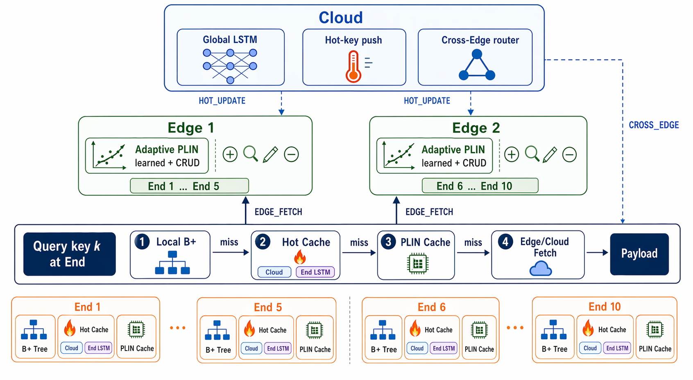

# ☁️🌿📱 PLIN Cloud-Edge-Device Learned Index

> 中文 / English bilingual README.  
> A three-layer learned-index runtime with Cloud LSTM hot-key prediction, Edge PLIN routing, and End-side four-stage lookup.



## 🌟 项目简介 / Project Overview

本项目把原始 PLIN learned index 改造成 **云-边-端三层架构**：

- ☁️ **Cloud**：维护全局 workload 视角，加载 `cloud_lstm.pt`，周期预测热点 End，并通过 `HOT_UPDATE` 下发热 key。
- 🌿 **Edge**：每个 Edge 管理一组 End 的 key range，构建区域 PLIN，向 End 推送 PLIN 参数，并处理同 Edge / 跨 Edge 查询。
- 📱 **End**：每个 End 持有本地 B+ shard、热缓存和父 Edge 的 PLIN 参数副本，执行四段式 lookup。

The active system is a **Cloud-Edge-Device learned-index runtime**:

- ☁️ **Cloud** owns global workload statistics and hot-key prediction.
- 🌿 **Edge** owns regional PLIN indexes and bridges Cloud/End traffic.
- 📱 **End** owns local shards, hot cache, parent PLIN cache, and measured lookup stages.

## ✅ 当前状态 / Current Status

| Milestone | 状态 / Status | 说明 / Notes |
|---|---:|---|
| M1 | ✅ | CMake, third-party layout, libtorch detection |
| M2 | ✅ | RPC frame, protocol types, topology parser, loopback test |
| M3 | ✅ | End local shard loading and stage ① local lookup |
| M4 | ✅ | Edge PLIN, `PLIN_PARAM_PUSH`, same-Edge fetch |
| M5 | ✅ | End hot cache, End LSTM model loading, hot replay path |
| M6 | ✅ | Cloud server, Cloud LSTM, `HOT_UPDATE`, cross-Edge routing |
| M7 | ✅ in progress | Benchmark script and report generation are available |

## 🧭 Runtime Architecture / 运行架构

```text
Cloud
  └── cloud_server
      ├── reads Data.txt and workload_log.csv
      ├── loads hot_lstm/models/cloud_lstm.pt
      ├── pushes HOT_UPDATE to target End via Edge
      └── routes CROSS_EDGE_REQ

Edge 1                         Edge 2
  ├── End 1                    ├── End 6
  ├── End 2                    ├── End 7
  ├── End 3                    ├── End 8
  ├── End 4                    ├── End 9
  └── End 5                    └── End 10
```

四段式查询 / Four-stage lookup:

1. 🏠 **Stage ① Local**：End 本地 B+ shard 查询。
2. ⚡ **Stage ② Hot Cache**：End 本地 libcuckoo 热缓存命中。
3. 🌿 **Stage ③ Same-Edge PLIN**：End 使用父 Edge 参数预测 slot，再向父 Edge 发 `EDGE_FETCH_REQ`。
4. ☁️ **Stage ④ Cross-Edge**：End → Edge → Cloud → Target Edge 跨边查询。

## 📁 目录结构 / Project Layout

```text
.
├── src/                         # Active C++ source tree
│   ├── core/index/              # PLIN learned-index core
│   ├── common/                  # Shared RPC, protocol, topology
│   ├── cloud/                   # Cloud runtime process
│   ├── edge/                    # Edge runtime process
│   ├── end/                     # End runtime process
│   └── tools/workload/          # Workload generation tools
├── hot_lstm/                    # Python training and TorchScript export
├── scripts/                     # Run, status, stop, benchmark helpers
├── output/                      # Runtime logs and benchmark reports
├── doc/                         # Architecture docs and overview image
├── legacy/                      # Old two-layer implementation, not built
├── third_party/                 # TLX and optional libtorch
├── libcuckoo/                   # Header-only hot-cache dependency
└── dataset/                     # Optional local demo data
```

### 🧩 `src/` 详细说明 / Detailed `src/` Layout

#### `src/core/index/` - PLIN 核心 / PLIN core

这里是原始 learned-index 数据结构和 End/Edge 共享的模型参数逻辑。它偏 header-only，是整个系统的索引内核。

| 文件 / File | 作用 / Responsibility |
|---|---|
| `plin_index.h` | Edge 侧区域 PLIN 主索引。提供 `bulk_load`, `find`, `find_through_net`, split/rebuild 等核心操作。 |
| `cache_model.h` | End 侧父 Edge PLIN 参数副本，用 `Param[][]` 预测 key 所在 leaf slot。 |
| `serialize.h` | `Param[][]` 序列化/反序列化，用于 `PLIN_PARAM_PUSH`。 |
| `parameters.h` | 全局 key/payload 类型、block size、epsilon、split/rebuild 阈值等 PLIN 参数。 |
| `piecewise_linear_model.h` | PGM-style piecewise linear fitting，用来生成 learned model segments。 |
| `inner_node.h` | PLIN 内部节点结构，组织 model segments 和 child pointers。 |
| `leaf_node.h` | PLIN leaf node，管理 leaf slots、overflow keys、range query 等。 |
| `b_plus.h` | Leaf overflow 的 B+ tree 实现。 |
| `hot_key.h` | 当前活跃构建中的轻量 stub，满足 `plin_index.h` 对旧 DatabaseLogger 类型的依赖。 |
| `utils.h` | 原子操作、基础 slot 结构、PLIN 内部通用工具。 |
| `flush.h` | 原始持久化/flush 辅助逻辑，当前主要作为 PLIN core 兼容依赖。 |
| `compare.h`, `pmallocator.h`, `spinlock.h`, `thread_pool.h`, `fast&fair.h` | 原 PLIN/PM tree 相关辅助组件，保留给核心索引代码引用和后续实验。 |

#### `src/common/` - 共享协议 / Shared runtime contracts

Cloud、Edge、End 都依赖这一层；这里不应该依赖具体进程逻辑。

| 文件 / File | 作用 / Responsibility |
|---|---|
| `proto.h` | `MsgType` 和 `Status` 枚举。定义 `EDGE_FETCH_REQ`, `HOT_UPDATE`, `CROSS_EDGE_REQ`, `HEARTBEAT` 等消息类型。 |
| `rpc.h`, `rpc.cpp` | 长度前缀 TCP frame：`[u32 length_be][u8 msg_type][body]`。 |
| `range_map.h`, `range_map.cpp` | 解析 topology，提供 `locate_end`, `edge_of`, `same_edge`, `siblings_of`。 |
| `topology.yaml` | 当前 demo 拓扑：1 Cloud、2 Edge、10 End，以及每个 End 的 key range。 |
| `loopback_test.cpp` | M2 测试：验证 RPC round-trip 和 topology 解析。 |
| `CMakeLists.txt` | 构建 `plin_common` 静态库和 `loopback_test`。 |

#### `src/cloud/` - Cloud runtime ☁️

Cloud 是全局协调者，不直接服务 End 长连接，但持有 Edge 控制连接。

| 文件 / File | 作用 / Responsibility |
|---|---|
| `cloud_server.cpp` | Cloud 主进程。加载 `Data.txt`、`workload_log.csv`、Cloud LSTM；周期发送 `HOT_UPDATE`；处理跨 Edge 查询。 |
| `cloud_lstm_runner.h` | Cloud LSTM runner 接口。 |
| `cloud_lstm_runner.cpp` | libtorch 实现，加载 `cloud_lstm.pt`，调用 TorchScript `predict_top_k`。 |
| `cloud_lstm_runner_stub.cpp` | 无 libtorch 时的 fallback，根据 workload count 简单排序。 |
| `CMakeLists.txt` | 构建 `cloud_server`，有 libtorch 时链接 Torch。 |

Cloud 关键消息 / Key messages:

- `HEARTBEAT(edge_id)`：Edge 注册到 Cloud。
- `HOT_UPDATE(target_end_id, kv_pairs)`：Cloud 下发热 key 到目标 End 所属 Edge。
- `CROSS_EDGE_REQ(request_id, key)`：跨 Edge lookup 路由。

#### `src/edge/` - Edge runtime 🌿

Edge 是 PLIN 的实际在线索引服务层，每个 Edge 管理 5 个 End 的 key range。

| 文件 / File | 作用 / Responsibility |
|---|---|
| `edge_server.cpp` | Edge 主进程。读取自身 range，构建 `PlinIndex`，向 End 推 `PLIN_PARAM_PUSH`，处理 `EDGE_FETCH_REQ`，连接 Cloud。 |
| `CMakeLists.txt` | 构建 `edge_server`，依赖 `plin_common`, `src/core/index`, `libcuckoo`。 |

Edge 关键行为 / Key behavior:

- 启动时对管理范围 `bulk_load` PLIN。
- End 连接后先发送 `PLIN_PARAM_PUSH`。
- 同 Edge 查询优先 `find_through_net(predicted_slot)`，失败后 fallback 到 full `find`。
- Cloud 推来的 `HOT_UPDATE` 会转发给目标 End。
- End 的 `CROSS_EDGE_REQ` 会经 Cloud 路由到目标 Edge。

#### `src/end/` - End runtime 📱

End 是 benchmark 的主要观测点，四段式 lookup 统计也在这里输出。

| 文件 / File | 作用 / Responsibility |
|---|---|
| `end_node.cpp` | End 主进程。加载本地 B+ shard，连接父 Edge，执行 self-test 和 benchmark 回放。 |
| `hot_cache.h`, `hot_cache.cpp` | libcuckoo 热缓存封装，支持 `find`, `upsert`, `batch_upsert`。 |
| `parent_plin_cache.h`, `parent_plin_cache.cpp` | End 持有的父 Edge PLIN 参数副本，消费 `PLIN_PARAM_PUSH`。 |
| `end_lstm_runner.cpp` | libtorch End LSTM loader。当前 runtime 主要验证模型加载。 |
| `end_lstm_runner_stub.cpp` | 无 libtorch fallback。 |
| `CMakeLists.txt` | 构建 `end_node`，有 libtorch 时链接 Torch。 |

End benchmark 参数 / Benchmark arguments:

```bash
build/end/end_node \
  --id 1 \
  --topology src/common/topology.yaml \
  --data /path/to/Data.txt \
  --model hot_lstm/models/end_lstm_1.pt \
  --bench-workload /path/to/workload_log.csv \
  --bench-queries 10000 \
  --bench-wait-ms 12000
```

#### `src/tools/workload/` - 工具 / Tools

| 文件 / File | 作用 / Responsibility |
|---|---|
| `device_generator.cpp` | 生成 timestamped workload CSV 的工具源码。输出格式为 `timestamp,device_id,key,operation`。 |

## 🧠 模型与数据链路 / Model and Data Pipeline

```text
src/tools/workload/device_generator.cpp
        │
        ▼
workload_log.csv ───────────────┐
        │                       │
        ▼                       ▼
hot_lstm/train.py        Cloud / benchmark loaders
        │
        ▼
hot_lstm/export.py
        │
        ▼
hot_lstm/models/*.pt
```

Data files:

- `Data.txt`：排序后的 key/payload 表，每行 `<key> <payload>`。
- `workload_log.csv`：访问流，每行 `timestamp,device_id,key,operation`。当前 `key` 列在 benchmark 中按 Data row position 解释，再映射为真实 key。

## 🔌 消息协议 / Message Protocol

消息类型定义在 `src/common/proto.h`。

| Message | Direction | Purpose |
|---|---|---|
| `EDGE_FETCH_REQ` | End → Edge | Same-Edge lookup with predicted PLIN slot. |
| `EDGE_FETCH_RESP` | Edge/Cloud → caller | Lookup status and payload. |
| `PLIN_PARAM_PUSH` | Edge → End | Push serialized parent PLIN parameters. |
| `HOT_UPDATE` | Cloud → Edge → End | Push hot key/payload pairs into End hot cache. |
| `CROSS_EDGE_REQ` | End → Edge → Cloud → Edge | Stage ④ cross-Edge lookup. |
| `HEARTBEAT` | End/Edge registration | Register End with Edge or Edge with Cloud. |
| `HEARTBEAT_ACK` | Cloud → Edge | Acknowledge Edge registration. |

## 🛠️ 构建 / Build

```bash
cmake -B build -DCMAKE_BUILD_TYPE=Release
cmake --build build -j "$(nproc)"
```

Build outputs:

```text
build/cloud/cloud_server
build/edge/edge_server
build/end/end_node
build/common/loopback_test
```

Quick check:

```bash
build/common/loopback_test
```

## 🚀 启动完整系统 / Run the Full System

```bash
bash scripts/run_all.sh \
  /path/to/Data.txt \
  src/common/topology.yaml \
  /path/to/workload_log.csv
```

Check status:

```bash
bash scripts/status_all.sh
```

Stop:

```bash
bash scripts/stop_all.sh
```

## 📊 Benchmark

Run 10k queries per End, 100k total queries:

```bash
bash scripts/bench.sh 10000 \
  /path/to/Data.txt \
  /path/to/workload_log.csv \
  src/common/topology.yaml
```

Outputs:

- `output/benchmark_3layer.csv`
- `output/benchmark_3layer.md`

Useful environment variables:

| Variable | Default | Meaning |
|---|---:|---|
| `PLIN_BENCH_WAIT_MS` | `12000` | Let End drain initial `HOT_UPDATE` before replay. |
| `PLIN_BENCH_TIMEOUT_SEC` | `900` | Wait limit for all 10 End benchmark rows. |
| `PLIN_BENCH_SKIP_BUILD` | unset | Set to `1` to skip build when binaries are already fresh. |
| `PYTHON` | `python3` | Python executable for report generation. Falls back to `/root/miniconda3/bin/python3` when needed. |

## 🧪 Verified Demo / 已验证示例

Small remote smoke benchmark:

```text
queries_per_end = 50
total_queries   = 500
found           = 500
not_found       = 0
```

Stage distribution from the smoke run:

| Stage | Count | Percent |
|---|---:|---:|
| Stage ① local | 50 | 10.00% |
| Stage ② hot cache | 126 | 25.20% |
| Stage ③ same-Edge PLIN | 144 | 28.80% |
| Stage ④ cross-Edge | 180 | 36.00% |

## 🧾 Notes for Maintainers / 维护说明

- Keep active runtime code under `src/`.
- Keep old two-layer code under `legacy/`; it is not part of the current CMake build.
- Keep large generated data out of commits when possible.
- `_odd` directories are treated as read-only data sources during remote experiments.
- `scripts/run_all.sh` intentionally keeps build output paths stable, even after moving source files into `src/`.

## 💛 Quick Mental Model

```text
End asks:
  "Do I own this key?"
      yes → local B+
      no  → hot cache?
      no  → same Edge?
      no  → ask Cloud to route across Edge
```

That is the whole system in one tiny thought. 🌱
