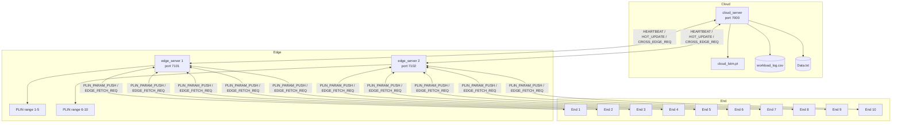

# PLIN Cloud-Edge-Device Architecture

This repository now uses a three-layer runtime:

- Cloud: global LSTM, workload aggregation, hot-key distribution, cross-Edge routing.
- Edge: regional PLIN index, PLIN parameter push, same-Edge lookup service, Cloud bridge.
- End: local shard, hot cache, parent PLIN parameter cache, four-stage lookup path.

## Source Layout

```text
.
├── src/
│   ├── core/index/        # PLIN core headers and serialization
│   ├── common/            # protocol, RPC frames, topology.yaml
│   ├── cloud/             # cloud_server + cloud LSTM runner
│   ├── edge/              # edge_server
│   ├── end/               # end_node + hot cache + End LSTM runner
│   └── tools/workload/    # workload generation source
├── hot_lstm/              # Python training/export pipeline and .pt models
├── scripts/               # run/status/stop/fetch helpers
├── legacy/                # old two-layer implementation, not built
├── third_party/           # TLX and optional libtorch
├── doc/                   # design notes and handoff docs
└── dataset/               # local demo data, when present
```

Active C++ code lives under `src/`. The old root-level PLIN headers were moved to `src/core/index/`; old two-layer client/server files stay under `legacy/`.

## Runtime Topology



Topology is configured in `src/common/topology.yaml`.

## Four-Stage Lookup

`src/end/end_node.cpp::EndNode::lookup` is the source of truth.

```text
lookup(key):
  if key belongs to this End range:
      Stage 1: local B+ tree lookup
  else if key exists in End hot cache:
      Stage 2: local libcuckoo hot cache lookup
  else if target End is under the same Edge:
      Stage 3: predict PLIN slot with parent PLIN cache
               send EDGE_FETCH_REQ to parent Edge
               warm hot cache on success
  else:
      Stage 4: send CROSS_EDGE_REQ to parent Edge
               Edge asks Cloud, Cloud routes to target Edge
               target Edge uses its PLIN and returns payload
               warm hot cache on success
```

## Lookup Sequence

```mermaid
sequenceDiagram
    autonumber
    participant End as End node
    participant HC as HotCache
    participant PC as ParentPlinCache
    participant Edge as Parent Edge
    participant Cloud as Cloud
    participant TEdge as Target Edge

    End->>End: locate_end(key)
    alt Stage 1: local range
        End->>End: local B+ find(key)
    else Stage 2: hot cache
        End->>HC: find(key)
    else Stage 3: same Edge
        End->>PC: predict_pos(key)
        End->>Edge: EDGE_FETCH_REQ(key, predicted_slot)
        Edge->>Edge: find_through_net; fallback find
        Edge-->>End: EDGE_FETCH_RESP(status, payload)
        End->>HC: upsert(key, payload)
    else Stage 4: cross Edge
        End->>Edge: CROSS_EDGE_REQ(request_id, key)
        Edge->>Cloud: CROSS_EDGE_REQ(request_id, key)
        Cloud->>TEdge: CROSS_EDGE_REQ(request_id, key)
        TEdge->>TEdge: PLIN find(key)
        TEdge-->>Cloud: EDGE_FETCH_RESP(status, payload)
        Cloud-->>Edge: EDGE_FETCH_RESP(status, payload)
        Edge-->>End: EDGE_FETCH_RESP(status, payload)
        End->>HC: upsert(key, payload)
    end
```

## Startup Sequence

```mermaid
sequenceDiagram
    autonumber
    participant Script as scripts/run_all.sh
    participant Cloud as cloud_server
    participant Edge as edge_server
    participant End as end_node

    Script->>Cloud: start first
    Cloud->>Cloud: load Data.txt, workload_log.csv, cloud_lstm.pt
    Script->>Edge: start Edge 1 and 2
    Edge->>Edge: load range and bulk_load PLIN
    Edge->>Cloud: HEARTBEAT(edge_id)
    Cloud-->>Edge: HEARTBEAT_ACK
    Script->>End: start End 1..10
    End->>End: load local B+ shard and End LSTM
    End->>Edge: connect
    Edge-->>End: PLIN_PARAM_PUSH(serialized params)
    End->>Edge: HEARTBEAT(end_id)
```

## Messages

Defined in `src/common/proto.h`.

| Type | Direction | Body | Meaning |
|---|---|---|---|
| `QUERY_REQ` | reserved | - | Reserved for external query clients. |
| `QUERY_RESP` | reserved | - | Reserved response type. |
| `EDGE_FETCH_REQ` | End -> Edge | `double key`, `int32 predicted_slot` | Same-Edge lookup using parent PLIN. |
| `EDGE_FETCH_RESP` | Edge/Cloud -> caller | `u8 status`, `u64 payload`, `u8 param_stale` | Lookup response. |
| `PLIN_PARAM_PUSH` | Edge -> End | serialized `Param[][]` | Parent Edge PLIN parameter snapshot. |
| `HOT_UPDATE` | Cloud -> Edge -> End | `u32 target_end_id` at Cloud-to-Edge hop, then key/payload pairs | Push hot keys into End cache. |
| `LSTM_TRAIN_TRIGGER` | reserved | - | Reserved for future online training trigger. |
| `CROSS_EDGE_REQ` | End -> Edge -> Cloud -> target Edge | `u64 request_id`, `double key` | Stage 4 cross-Edge lookup. |
| `HEARTBEAT` | Edge/End registration | `u32 id` | Register Edge with Cloud or End with Edge. |
| `HEARTBEAT_ACK` | Cloud -> Edge | empty | Registration acknowledgement. |

All runtime messages use `src/common/rpc.*`: `[u32 length_be][u8 msg_type][body]`.

## Offline Data and Model Pipeline

```text
src/tools/workload/device_generator.cpp
        |
        v
data/workload_log.csv          dataset/Data.txt
        |                            |
        v                            v
hot_lstm/train.py              Edge/End/Cloud data loaders
        |
        v
hot_lstm/export.py
        |
        v
hot_lstm/models/cloud_lstm.pt
hot_lstm/models/end_lstm_1.pt ... end_lstm_10.pt
```

Training remains Python-based. Runtime inference is in-process C++ libtorch when available, with stub fallback when libtorch is absent.

## Build and Run

Build:

```bash
cmake -B build -DCMAKE_BUILD_TYPE=Release
cmake --build build -j "$(nproc)"
```

Run the full local topology:

```bash
bash scripts/run_all.sh \
  /path/to/Data.txt \
  src/common/topology.yaml \
  /path/to/workload_log.csv
```

Check status:

```bash
bash scripts/status_all.sh
```

Stop:

```bash
bash scripts/stop_all.sh
```

Benchmark:

```bash
bash scripts/bench.sh 10000 \
  /path/to/Data.txt \
  /path/to/workload_log.csv \
  src/common/topology.yaml
```

The benchmark starts the full Cloud/Edge/End topology, asks every End to replay
the same workload positions through `EndNode::lookup`, and writes:

- `output/benchmark_3layer.csv`
- `output/benchmark_3layer.md`

Build outputs intentionally remain stable:

- `build/cloud/cloud_server`
- `build/edge/edge_server`
- `build/end/end_node`
- `build/common/loopback_test`
